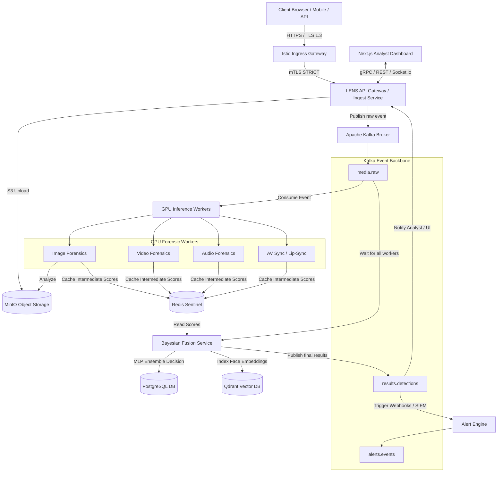

# LENS Deepfake & AI Forensic Detection Platform

Welcome to **LENS (Large-Scale Forensic Evidence Network System)**. LENS is a state-of-the-art, production-grade, multi-modal deepfake detection and digital forensics platform. It is engineered to ingest, process, analyze, and audit digital media (images, audio, and video) at scale using distributed deep learning models, high-throughput event brokers, and a zero-trust orchestrator.

This repository contains the complete codebase for all platform microservices, ML training utilities, cloud-native Helm charts, GitOps configurations, and the premium Next.js analyst interface.

---

## 🗺️ System Architecture Overview

LENS is architected as a distributed, decoupled, event-driven microservices system. The platform orchestrates media files through a highly secure ingestion gateway, processes them across specialized GPU-accelerated deep learning inference workers, aggregates multi-modal predictions via a neural Bayesian Fusion model, and visualizes results in a premium Next.js dashboard.



---

## 🛠️ What Has Been Done (Completed Features)

### 1. decopled Microservices & Core Pipelines
* **[api_service](file:///d:/isafe2/api_service)**: A high-throughput API gateway written in **FastAPI** exposing REST and **gRPC** endpoints for media ingestion, UUIDv4 case orchestration, real-time case checks, and secure rate-limiting backed by Redis.
* **[image_forensics_service](file:///d:/isafe2/image_forensics_service)**: Core worker evaluating single-frame forgery using PRNU (sensor noise) prints, high-frequency grids, and CNN classifiers.
* **[video_forensics_service](file:///d:/isafe2/video_forensics_service)**: Core worker utilizing recurrent/attention networks (Timesformer) to catch frame-splicing and face-swaps.
* **[audio_forensics_service](file:///d:/isafe2/audio_forensics_service)**: Waveform deep networks classifying Mel-spectrograms to identify AI-synthesized voices.
* **[av_sync_service](file:///d:/isafe2/av_sync_service)**: Inspects facial landmarks and timing alignments (SyncNet) to detect lip-sync deepfakes.
* **[fusion_service](file:///d:/isafe2/fusion_service)**: Neural Bayesian MLP aggregator pooling intermediate scoring vectors from Redis, evaluating calibrated certainty indices, and writing outcomes to PostgreSQL.

### 2. Next.js 14 Premium Analyst Dashboard
* **Sleek Interface ([lens-ui](file:///d:/isafe2/lens-ui))**: A custom, modern dark-mode interface utilizing Google Inter typography, HSL tailored gradients, drag-and-drop media uploaders (`react-dropzone`), and interactive forensic charts (`recharts`).
* **Real-time Synchronization**: Integrates **Socket.io** to reflect status transitions (`INGESTED` $\rightarrow$ `PROCESSING` $\rightarrow$ `COMPLETE`) live as messages traverse the Kafka event pipeline.
* **Security & Clean Compilation**: Added a mandatory Next.js App Router root [app/layout.tsx](file:///d:/isafe2/lens-ui/app/layout.tsx), configured `output: "standalone"`, and corrected invalid Python-style `#` comments inside TypeScript files.

### 3. Distributed Database & Event Backbone
* **Docker Compose Orchestration ([docker-compose.yml](file:///d:/isafe2/docker-compose.yml))**: Full integration with **Apache Kafka (KRaft mode)**, **PostgreSQL (Patroni HA)**, **Redis Sentinel**, **MinIO**, **Qdrant Vector DB**, and **Keycloak** (OIDC Authentication & RBAC).
* **Kafka Upgrade**: Replaced deprecated/removed public images with the official `apache/kafka:latest` and restored standard KRaft node config rules.
* **Port Conflict Mitigation**: Freeing development host ports by cleanly shutting down overlapping container services.

### 4. GitOps & Cloud-Native DevOps Layer
* **Kubernetes Orchestration**: Outlined modular Helm charts ([helm/](file:///d:/isafe2/helm)) for Calico, Cert-Manager, Falco, GPU Operator, Istio, KEDA, Kube-Prometheus, and Loki.
* **GitOps Standard**: Pre-configured [helmfile.yaml](file:///d:/isafe2/helmfile.yaml) for strict multi-namespace topologies (`lens-api`, `lens-gpu`, `lens-storage`, `lens-monitoring`).
* **Autoscaling**: Formulated KEDA `scaledobject.yaml` manifests for dynamic, latency-driven queue scaling of worker containers.

---

## 🚀 What Is Yet To Be Done (Project Roadmap)

### 1. In-Cluster Model Drift & Retraining Loops
- [ ] **Drift Engine Deployment**: Finalize the continuous evaluation CronJob inside [ml/training](file:///d:/isafe2/ml/training) to trigger validation tests (Kolmogorov-Smirnov & PSI) on inference data.
- [ ] **Active Analyst Feedback**: Implement an interface button where analysts can manually flag classification errors (e.g. false positives) to seed a feedback loop writing back to the Postgres retraining schema.

### 2. Physical GPU Optimization & Load Benchmarks
- [ ] **Triton/TorchServe Validation**: Verify real GPU performance and SM load-balancing using TensorRT quantization models on cluster nodes.
- [ ] **Benchmark Latency Tests**: Run [tests/load_test.js](file:///d:/isafe2/tests/load_test.js) under simulated peak load to map end-to-end processing delays.

### 3. Federated Identity Configuration
- [ ] **Keycloak Auto-Seeding**: Write bootstrap shell scripts to automatically set up OAuth client credentials, custom scopes, and Analyst/Admin user roles inside production Keycloak instances during cluster initialization.

### 4. Chaos Resilience Auditing
- [ ] **Resilience Testing**: Execute the defined Chaos Mesh suite ([tests/chaos_mesh.yaml](file:///d:/isafe2/tests/chaos_mesh.yaml)) to observe system failover when broker-to-worker network partitions occur under sustained traffic.

---

## 💻 Local Quickstart

### 1. Prerequisites Check
Verify at least **16GB RAM** and **4 vCPUs** are assigned to Docker. Verify ports `3000`, `8000`, `9000`, `5432`, `6379`, and `8080` are free on the host.

### 2. Boot the Stack
Run in the repository root directory:
```bash
# Launch all 13 services in the background using the secure local environment
docker compose --env-file .env.local up -d

# Check cluster health
docker compose ps
```

### 3. Access Dashboard
Navigate to: **http://localhost:3000**  
Log in with standard pre-seeded Analyst credentials:
* **Username**: `analyst@lens.local`
* **Password**: `Lens@1234`
